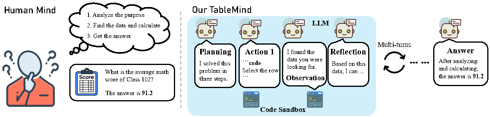
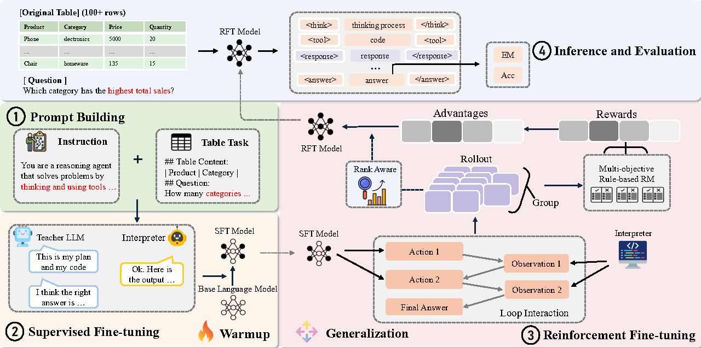

<div align="center">
<h1>
TableMind: An Autonomous Programmatic Agent for Tool-Augmented Table Reasoning
</h1>
</div>

<div align="center">
  <a href="https://huggingface.co/Jclennon/TableMind">
    🤗 <strong>Model (TableMind)</strong>
  </a> |
  <a href="https://huggingface.co/datasets/Jclennon/TableMind-data">
    📊 <strong>Train and Eval Dataset</strong>
  </a> |
  <a href="https://arxiv.org/abs/2509.06278">
    📖 <strong>Paper</strong>
  </a>
</div>

## 📖 Abstract
**TableMind introduces the study of autonomous table reasoning with large language models. We propose a two-stage fine-tuning framework that combines supervised trajectory learning with reinforcement optimization via RAPO, a rank-aware strategy for improving reasoning accuracy. Our agent performs multi-turn tool invocation, executes code in a secure sandbox for precise numerical analysis, and leverages planning and reflection for adaptive strategies.**

This repository contains the official code for our [paper](https://arxiv.org/abs/2509.06278):
> **TableMind: An Autonomous Programmatic Agent for Tool-Augmented Table Reasoning** > Chuang Jiang,
Mingyue Cheng,
Xiaoyu Tao,
Qingyang Mao,
Jie Ouyang,
Qi Liu

🚩 **News** (Sep. 2025): The final version of the paper was polished and successfully submitted to [arXiv](https://arxiv.org/abs/2509.06278).

## 🌟 Overview
<div align="center">

<p><em></em></p>
</div>

Large Language Models (LLMs) demonstrate impressive capabilities but often struggle with the complex numerical computations and fine-grained operations required for table reasoning. **TableMind** addresses this by introducing a novel **two-stage fine-tuning paradigm**, guided by a custom-designed multi-objective reward framework  that explicitly shapes autonomous tool use and reflection. Our approach progressively develops:
1. **(Stage 1: SFT for Warmup Adaption)** Foundational skills through supervised fine-tuning , where the LLM learns to use tools and follow a plan-action-reflect cycle using high-quality reasoning trajectories distilled from expert models, ensuring proper structure and usage patterns.
2. **(Stage 2: RFT for Strategic Autonomy)** Advanced table reasoning via Reinforcement Fine-tuning, with rewards based on structural correctness, final answer accuracy, and strategic tool interaction. **RAPO** (Rank-Aware Policy Optimization) enhances reasoning paths by increasing the update weight of high-quality trajectories, guiding the model more consistently toward better and more accurate answers.
<p align="center"></p>

## ⚙️ Key Features

*   **Autonomous Agent with Plan-Action-Reflect Loop:** Trains an LLM to perform deliberate, multi-step table reasoning by iteratively planning, generating and executing code, and reflecting on the outcomes to adapt its strategy.
*   **Two-Stage Training Paradigm:** Combines warm-up Supervised Fine-tuning (SFT) to establish foundational tool-use patterns with Reinforcement Fine-tuning (RFT) for advanced, autonomous strategy optimization.
*   **RAPO: Rank-Aware Policy Optimization:** A novel reinforcement learning algorithm that increases the update weight of high-quality reasoning trajectories.
*   **Multi-Objective Reward Design:** Employs a fine-grained reward function composed of three key components—structural correctness, final answer accuracy, and strategic tool interaction—to effectively guide the agent's learning process.

## 🚀 Quick Start
### Environment Setup

#### TableMind Environment

```bash
conda env create -f environment.yml
```

#### Sandbox Fusion

1. **Install Sandbox Fusion**  
2. **Run Sandbox Fusion in a tmux session**  
Please follow the official installation guide here: [SandboxFusion](https://github.com/bytedance/SandboxFusion)

## 🛠️ Training
### Time-R1 RL Training

1. Extract the files under the `csv_files` directory.
2. Update the CSV file path in the `agent_r1/tool/tools/python_tool.py` file.
```bash
# Run training
bash run.sh
```